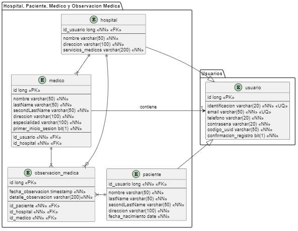

# Base de datos

Usando *Postgresql vs 15.2*, que es una base de datos relacional, se crea la base de datos del proyecto con el nombre de **medilogportal**. Esta se contruye teniendo en cuenta el siguiente diagrama de entidad-relación:

<div style="text-align:center;">

</div>

<br>

Se hace uso de Sequelize para mapear todas las relaciones de los modelos con ORM. Para la configuración de parámetros de conexión a la base de datos se debe crear un archivo ***.env*** en la raíz del proyecto e incluir lo siguiente:

```
PORT=4000
DB_USER='escribir el nombre de usuario de la db, por lo general es postgres'
DB_PASSWORD='escribir la contraseña de la db'
DB_HOST='localhost'
DB_NAME='medilogportal'
DB_PORT='5432'
```
En la ruta ***src\database*** se encuentra el archivo ***medilogportal.sql***, que es la base de datos usada en este proyecto y ha sido exportado desde Postgresql 15.2.